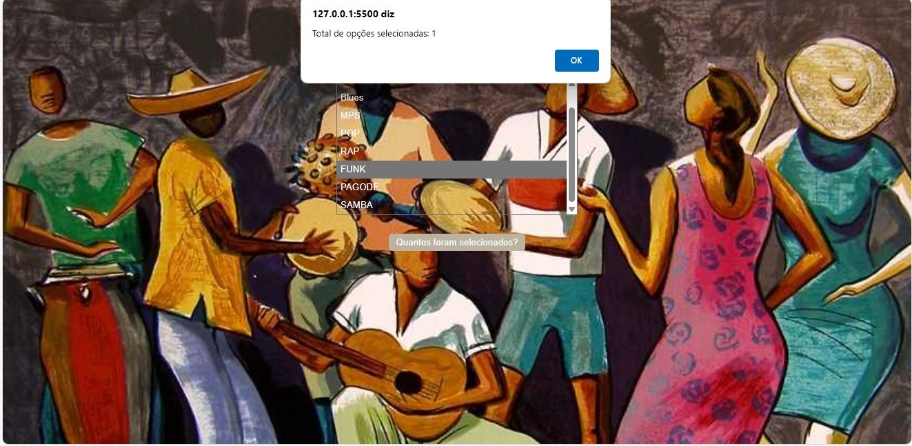

# Seleção Múltipla de Música

* Este é um código HTML e JavaScript que cria um formulário interativo com uma lista suspensa de seleção múltipla, permitindo que o usuário escolha vários tipos de música.

# Funcionalidades
### Contador de Seleções
* O JavaScript associado ao botão "Quantos foram selecionados?" conta quantas opções foram escolhidas na lista suspensa quando o botão é clicado. Ele utiliza a função *howMany*, que recebe o objeto de seleção como argumento e percorre todas as opções para determinar quantas estão selecionadas. Em seguida, exibe um alerta com o total de opções selecionadas.
### Função howMany
* Esta função recebe o objeto de seleção como argumento e itera sobre todas as opções dentro dele. Ao encontrar uma opção selecionada, incrementa um contador. O contador final é então retornado, representando o número total de opções selecionadas.
# Ferramentas utilizadas
* CSS
* JavaScript 
* VScode 
* Git Hub 
* Chat GPT
# Sites consultados 
* [MDN WEB DOCS](https://developer.mozilla.org/pt-BR/docs/Web/JavaScript/Guide/Control_flow_and_error_handling)
# Utilidade
* Este código pode ser facilmente adaptado para diferentes propósitos, além de música. Basta modificar as opções na lista suspensa para refletir o que deseja-se permitir ao usuário selecionar.
* Para incorporar este formulário em um projeto existente ou novo, basta copiar o código HTML e JavaScript fornecidos nos arquivos correspondentes e integrá-los conforme necessário.
# Autora

